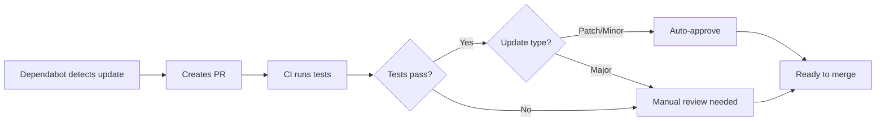

# Dependabot Configuration

This repository uses GitHub Dependabot to automatically manage dependency updates and security vulnerabilities.

## What Dependabot Does

1. **Monitors Dependencies** - Checks for updates to npm packages weekly
2. **Creates Pull Requests** - Automatically opens PRs for dependency updates
3. **Security Alerts** - Notifies about security vulnerabilities
4. **Auto-Approval** - Automatically approves safe patch/minor updates that pass tests

## Configuration

### Dependabot Settings (`.github/dependabot.yml`)

- **Schedule**: Runs every Monday at 9 AM EST
- **Max PRs**: Up to 10 open PRs for npm dependencies
- **Auto-assign**: PRs automatically assigned to @sirhCC
- **Labels**: Tagged with `dependencies` and `npm`
- **Grouping**: Minor and patch updates grouped by dependency type

### Update Types

| Type | Description | Auto-Approved | Example |
|------|-------------|---------------|---------|
| **Patch** | Bug fixes (1.0.x) | ✅ Yes | 1.0.0 → 1.0.1 |
| **Minor** | New features (1.x.0) | ✅ Yes | 1.0.0 → 1.1.0 |
| **Major** | Breaking changes (x.0.0) | ❌ No | 1.0.0 → 2.0.0 |

## Workflow

### Automatic Process



### Manual Steps

1. **Review PR** - Check the changelog and breaking changes
2. **Approve** - If safe, approve the PR
3. **Merge** - Merge when ready

## CI Integration

The `.github/workflows/dependabot.yml` workflow:

- ✅ Runs on all Dependabot PRs
- ✅ Tests on Node.js 18.x and 20.x
- ✅ Builds the TypeScript project
- ✅ Auto-approves patch and minor updates
- ✅ Adds helpful comments to PRs

## Ignoring Dependencies

To ignore specific dependencies, edit `.github/dependabot.yml`:

```yaml
ignore:
  - dependency-name: "package-name"
    update-types: ["version-update:semver-major"]
```

## Security Alerts

Dependabot will create PRs for security vulnerabilities immediately, regardless of schedule.

**Priority Levels:**
- 🔴 Critical - Immediate attention required
- 🟠 High - Review within 24 hours
- 🟡 Medium - Review within 1 week
- 🟢 Low - Review when convenient

## Checking Status

### View Dependabot Status
```bash
# Via GitHub CLI
gh pr list --label dependencies

# Via GitHub web
# Navigate to: https://github.com/sirhCC/Infrastructure-Drift-Detector/security/dependabot
```

### View Security Alerts
```bash
# Via GitHub CLI
gh api repos/sirhCC/Infrastructure-Drift-Detector/dependabot/alerts
```

## Managing PRs

### Approve a PR
```bash
gh pr review <PR_NUMBER> --approve
```

### Merge a PR
```bash
gh pr merge <PR_NUMBER> --auto --squash
```

### Close a PR
```bash
gh pr close <PR_NUMBER>
```

### Rebase Dependabot PR
Add a comment to the PR:
```
@dependabot rebase
```

### Recreate Dependabot PR
Add a comment to the PR:
```
@dependabot recreate
```

## Dependabot Commands

You can interact with Dependabot by commenting on PRs:

- `@dependabot rebase` - Rebase the PR
- `@dependabot recreate` - Recreate the PR
- `@dependabot merge` - Merge the PR (if approved)
- `@dependabot squash and merge` - Squash and merge
- `@dependabot cancel merge` - Cancel auto-merge
- `@dependabot reopen` - Reopen a closed PR
- `@dependabot close` - Close the PR
- `@dependabot ignore this dependency` - Ignore this dependency
- `@dependabot ignore this major version` - Ignore major version updates
- `@dependabot ignore this minor version` - Ignore minor version updates

## Best Practices

### DO ✅
- Review changelogs for major updates
- Test major updates locally before merging
- Keep dependencies up to date regularly
- Monitor security alerts
- Merge patch updates quickly

### DON'T ❌
- Ignore security updates
- Let PRs pile up (increases merge conflicts)
- Auto-merge major updates without testing
- Disable Dependabot (unless replacing with another tool)

## Troubleshooting

### Too Many PRs
Reduce `open-pull-requests-limit` in `.github/dependabot.yml`

### Conflicts
Comment `@dependabot rebase` on the PR

### CI Failing
Check the workflow logs and fix build issues

### Dependabot Not Running
- Check repository settings > Security > Dependabot
- Verify `.github/dependabot.yml` syntax
- Ensure Dependabot has permissions

## Current Dependencies

This project uses:
- TypeScript
- Node.js packages (see `package.json`)
- AWS SDK v3
- Commander (CLI)
- Chalk (terminal colors)
- js-yaml (YAML parsing)
- And more...

Dependabot monitors all of these for updates.

## Links

- [Dependabot Documentation](https://docs.github.com/en/code-security/dependabot)
- [Configuration Options](https://docs.github.com/en/code-security/dependabot/dependabot-version-updates/configuration-options-for-the-dependabot.yml-file)
- [Security Advisories](https://github.com/advisories)

---

**Last Updated**: November 13, 2025
